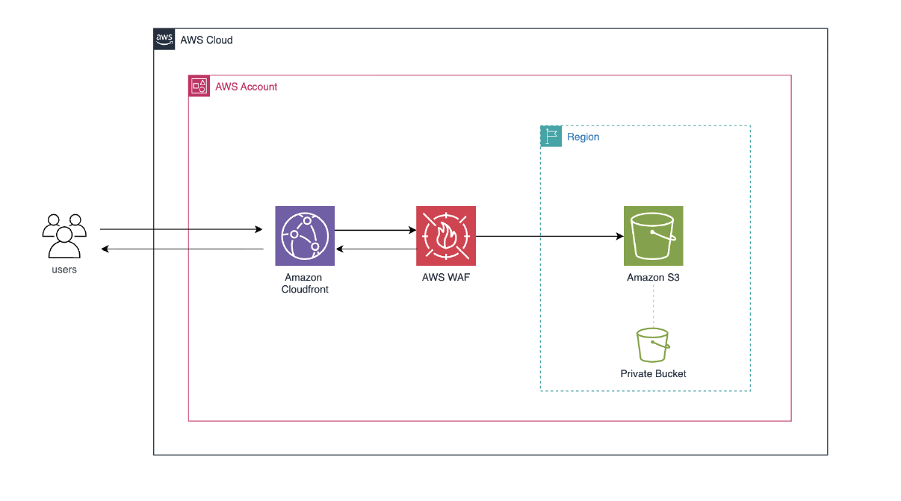
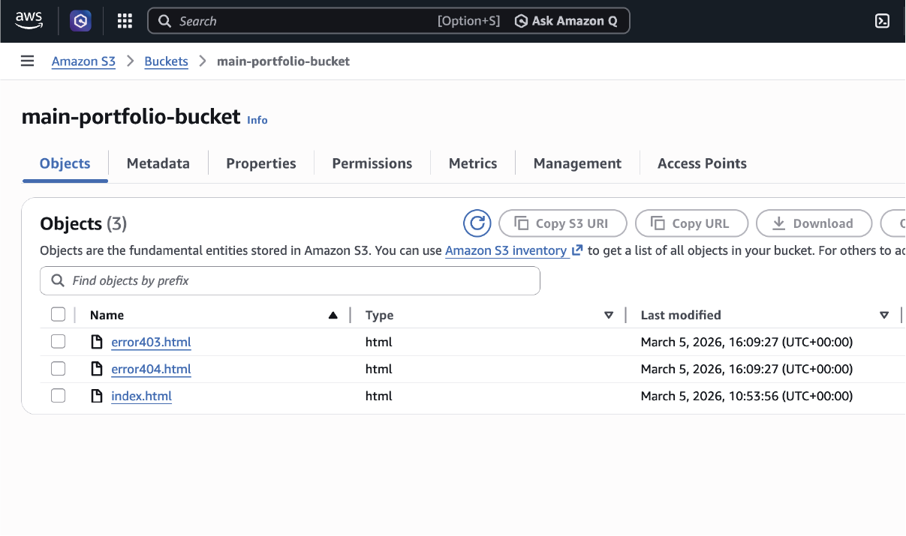
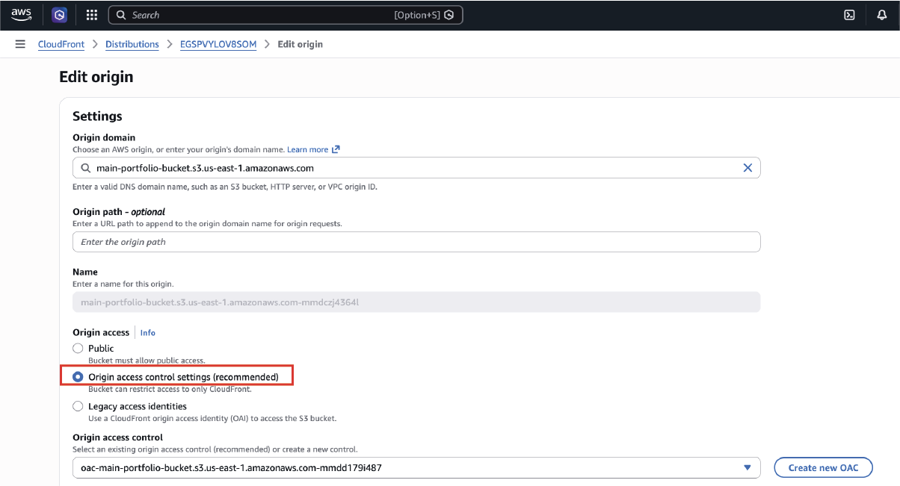
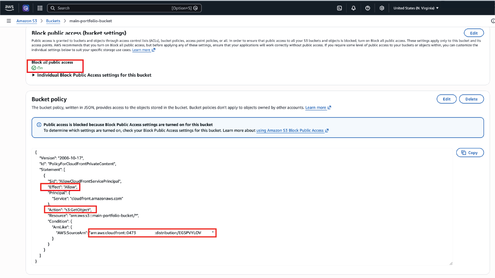
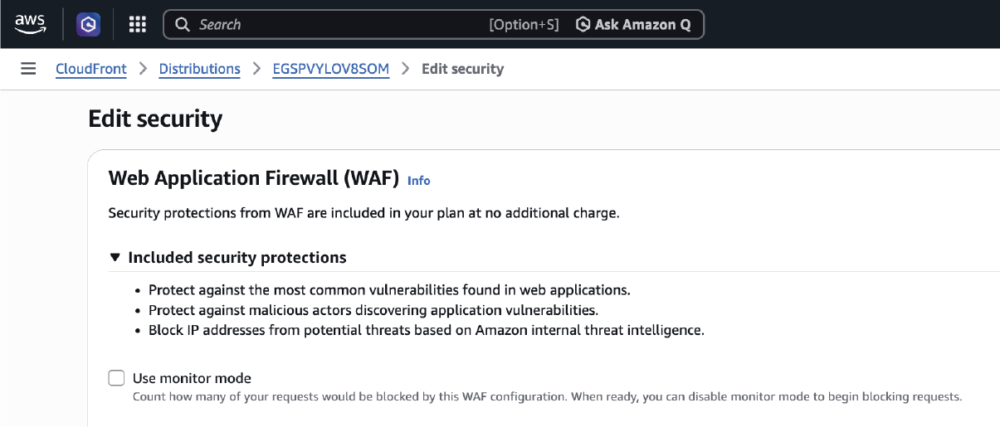
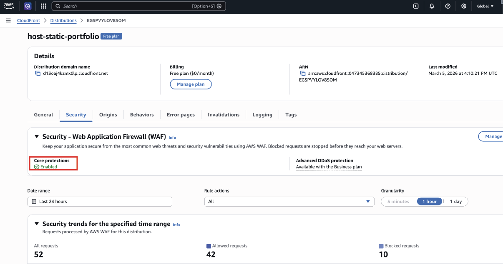
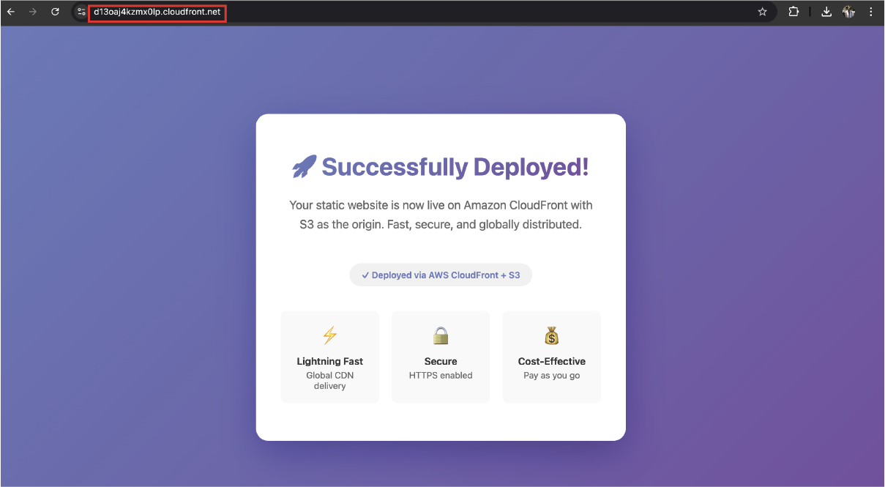
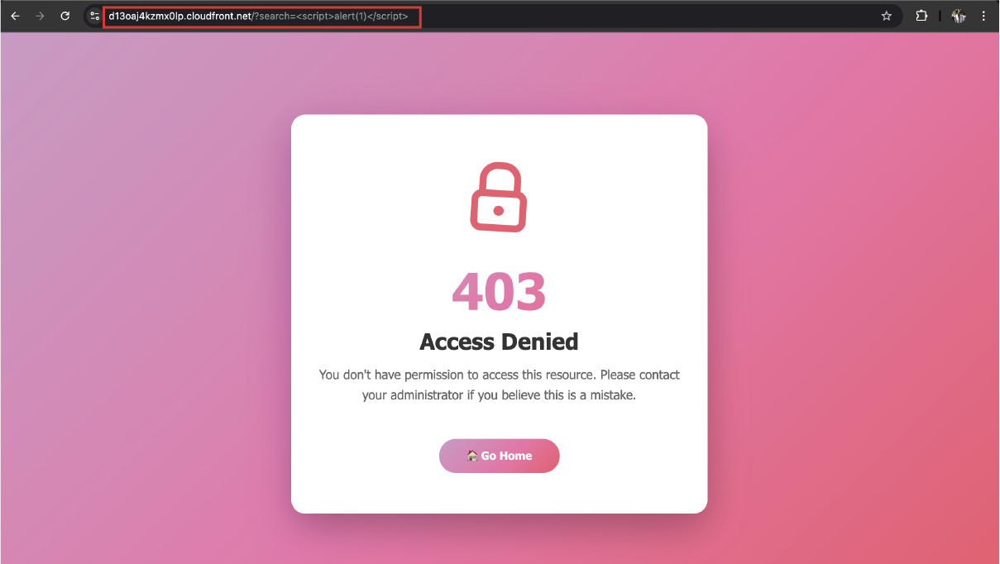
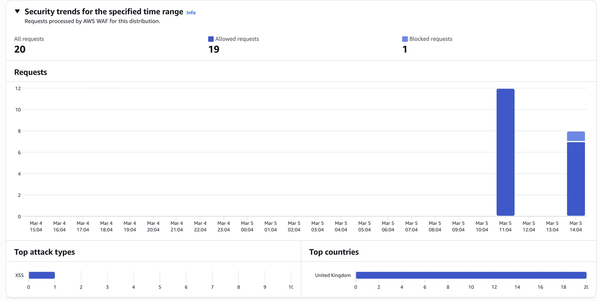

# Secure Edge-to-Origin Static Web Architecture on AWS

Secure static website architecture on AWS using CloudFront, WAF, and a private S3 origin protected with Origin Access Control (OAC).

## Overview

This project demonstrates a secure approach to hosting a static website on AWS while ensuring that the origin storage layer is not directly exposed to the public internet.

Instead of serving the website directly from Amazon S3, the architecture introduces Amazon CloudFront as the edge entry point, where security controls and caching mechanisms are applied before requests reach the origin.

The implementation reflects modern cloud security practices where backend infrastructure remains private and accessible only through controlled service integrations.

## Problem Context

Static websites are commonly hosted using S3 Static Website Hosting, where the S3 bucket is made publicly accessible.

Typical deployment:

```
User → S3 Static Website Endpoint
```

While simple to configure, this approach introduces several security concerns:

- The storage layer is directly exposed to the internet
- There is no centralized inspection of incoming traffic
- Misconfigured permissions can expose stored objects
- Malicious traffic reaches the origin without filtering

For secure production environments, it is preferable to restrict direct access to storage resources and place security controls at the network edge.

## Solution Architecture

To address these concerns, this project implements a private origin architecture using Amazon CloudFront and AWS WAF.

```
User
  |
  v
CloudFront CDN
  |
  v
AWS WAF
  |
  v
Private S3 Bucket
```

In this design:

- Amazon S3 stores the static website assets
- Amazon CloudFront acts as the public entry point
- AWS WAF inspects requests before they reach the origin
- Origin Access Control restricts S3 access to CloudFront only

This architecture ensures that the storage layer remains private while the website remains globally accessible.

## Architecture Diagram

When uploaded, this diagram will appear here.



## Core AWS Services

| Service | Role |
|-------|------|
| Amazon S3 | Stores static website assets |
| Amazon CloudFront | Global CDN used to deliver content |
| AWS WAF | Protects the application from common web threats |
| Bucket Policies | Enforces least-privilege access between services |

## Security Controls

### Private Origin Storage

The S3 bucket has **Block Public Access enabled**, preventing objects from being accessed directly from the internet.

Static website hosting is intentionally disabled so the bucket functions strictly as a **private origin**.

### Origin Access Control (OAC)

CloudFront retrieves objects from S3 using **Origin Access Control**, which allows the bucket policy to restrict access exclusively to the CloudFront distribution.

This prevents users from bypassing CloudFront and accessing objects directly from S3.

### Edge Security with AWS WAF

AWS WAF is attached to the CloudFront distribution to inspect incoming HTTP requests.

Managed rule groups are used to mitigate common threats including:

- SQL injection attempts
- Cross-site scripting (XSS)
- Traffic originating from known malicious IP addresses

## System Implementation

Website assets are stored in a private Amazon S3 bucket with public access blocked.

A CloudFront distribution is configured to serve the content globally while enforcing HTTPS for all client requests.

Origin Access Control is implemented to allow CloudFront to securely retrieve objects from the S3 bucket. The bucket policy restricts read access exclusively to the CloudFront distribution.

AWS WAF is associated with the CloudFront distribution to filter and block malicious requests before they reach the origin.

## Security Validation

The architecture was validated through several access tests.

| Test | Result |
|----|----|
Direct access to S3 object | Not Exposed |
Access through CloudFront | Website loads successfully |
Malicious XSS request | Blocked by WAF (403) |


These checks confirm that the origin storage remains private while the website remains accessible through CloudFront.


## Implementation Evidence


### Website Files Uploaded




### Origin Access Control




### S3 Bucket Policy




### AWS WAF Configuration







### Website Served Through CloudFront




## WAF Test Evidence

To validate that AWS WAF was actively inspecting traffic, a simulated cross-site scripting payload was sent to the CloudFront endpoint.

Example request:

```
https://d13oaj4kzmx0lp.cloudfront.net/?search=<script>alert(1)</script>
```

The request triggered the WAF managed rule set and resulted in a **403 Forbidden response**, confirming that the firewall blocked the malicious input before reaching the origin.





### XSS WAF Test



## Design Insights

This implementation highlights several important cloud architecture principles:

- Public access to storage services should be avoided whenever possible
- CDN services can serve as secure entry points for web applications
- Edge security controls help reduce the attack surface of backend infrastructure
- Proper service-to-service permissions are critical for enforcing least-privilege access

## Skills Demonstrated

- CloudFront edge architecture
- Private S3 origin configuration
- Origin Access Control (OAC)
- AWS WAF deployment and rule configuration
- Secure cloud infrastructure design
- CDN-based application delivery

## Potential Improvements

Future enhancements could include:

- Custom domain configuration with Route 53
- TLS certificate management using AWS Certificate Manager
- CloudFront access logging and monitoring
- Infrastructure deployment using Infrastructure as Code (Terraform or CloudFormation)

This project is part of my **AWS Cloud Engineer Portfolio Series**, where I build practical cloud architectures to deepen my understanding of cloud security, infrastructure engineering, and distributed systems.
